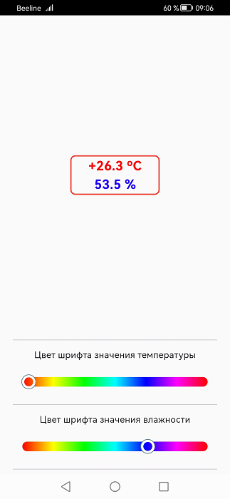
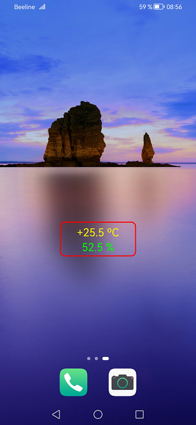

## android_libusb

#### Приложение для Android
Цель данного проекта — отработать обмен данными по USB с применением библиотеки **libusb** на платформе Android.  

    

  

#### Описание
Данное приложение использует для взаимодействия с микроконтроллером Flutter пакеты:  
https://pub.dev/packages/libusb_android_helper  
https://pub.dev/packages/libusb_android  

Если в приложении прописано разрешение для VID и PID подключаемого устройства, то запуск приложения просходит сразу при присоединении кабеля USB.

Код для микроконтроллера STM32F103 расположен по адресу:

https://github.com/sergeyerofeev/Projects_on_STM32F103/tree/main/i2c_aht21b

В самом приложении имеется возможность только изменять цвет шрифта значений температуры и влажноси, затем приложение переводится в фоновый режим и вывод данных можно наблюдать на рабочем экране.

Стандартными способами подключаем виджет приложения к рабочему экрану.  

    

  

---
Для создания виджета рабочего экрана был использован Flutter пакет **home_widget**:  

https://pub.dev/packages/home_widget

Так как разметка виджета выполнена на xml, который статичен, возникают следующие ограничения:  
1.	Нельзя динамически изменить размер и цвет рамки 
2.	Не корректно работает изменение размера шрифта, происходит только его увеличение.
3.	Нормально можно изменить только цвет шрифта  

---

